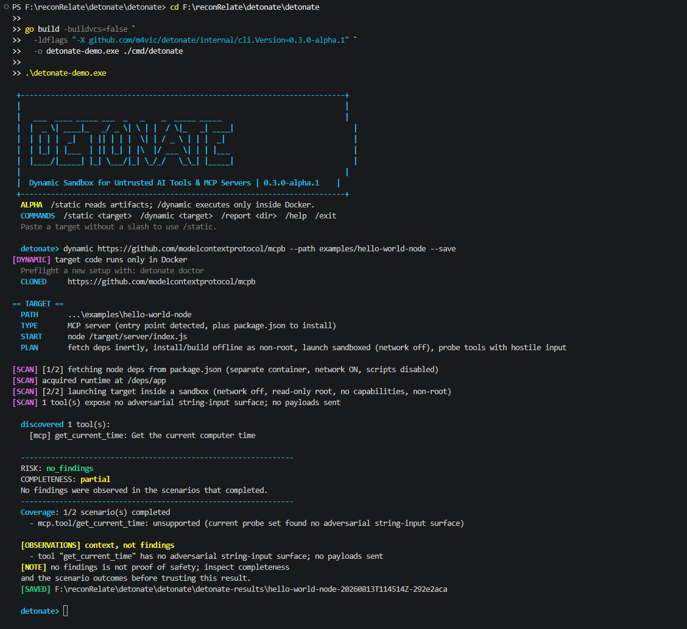

# detonate
<p align="center">
  
</p>


<p align="center">
  
  <a href="https://github.com/m4vic/detonate/stargazers"></a>
  <a href="https://github.com/m4vic/detonate/network/members"></a>
  
  
</p>


> **This project is constantly evolving and is currently not production-grade.**
> Detonate can have bugs, false
> positives, and false negatives. A `no_findings` result is not a security
> certification. Use disposable test targets, never provide real secrets, and
> read the full [disclaimer](DISCLAIMER.md) before running dynamic scans.


<p align="center"><em>A real public MCP server scan. Dynamic execution stays in Docker; the report keeps incomplete coverage explicit.</em></p>

## Use it in CI

Test your MCP server or Agent Skill **before you publish it**. Add this to
`.github/workflows/detonate.yml`:

```yaml
name: detonate
on: [push, pull_request]

permissions:
  contents: read
  security-events: write   # so findings reach the Security tab

jobs:
  test:
    runs-on: ubuntu-latest
    steps:
      - uses: actions/checkout@v4
      - uses: m4vic/detonate@v1
```

That runs a scan on every push, fails the job on findings, and publishes SARIF
so results appear in **Security → Code scanning** and inline on pull requests.

| Input | Default | What it does |
|---|---|---|
| `target` | `.` | Path or git URL to scan |
| `mode` | `static` | `static` never executes the target; `dynamic` runs it in a Docker sandbox and enumerates its real tools |
| `version` | `latest` | Pin a release for reproducible CI |
| `fail-on` | `findings` | `findings` (exit 3), `incomplete` (also exit 4 — strict), or `never` (report only) |
| `upload-sarif` | `true` | Publish to GitHub code scanning |
| `args` | — | Extra flags, e.g. `--path packages/server` |

Exit codes are stable and safe to gate on: **0** clean, **1** error, **2** usage,
**3** findings, **4** incomplete.

Start with `mode: static` — it always completes and needs no Docker. Move to
`mode: dynamic` once you have confirmed your server starts in CI; that is where
detonate actually runs your code and reports what it did.

Adopting on an existing project? Start with `fail-on: never` to see findings
without blocking anyone, then turn the gate on.

## Why Detonate:
Today, thousands of developers install Model Context Protocol (MCP) servers and AI Agent Skills from GitHub directly onto their local systems. They run with **your local user permissions**, and your AI assistant invokes their tools automatically behind the scenes. 

Most people install these tools without considering the consequences:
- **Nobody reads the code first.**
- **Unbounded execution:** An MCP server running locally has access to your local filesystem, environment variables, and network.
- **Manifests can lie:** Static scanners check manifests and source code to see what a tool *claims* to do. They cannot show what happens when the tool receives unexpected or hostile inputs.

**Detonate was built to solve this problem first:** instead of trusting claims, Detonate launches untrusted MCP servers and skills in a disposable, air-gapped sandbox (no network, read-only root, dropped capabilities) and actively probes their tools with adversarial payloads to prove what they *actually* do before you run them on your system.

```
detonate: discovered 1 tool(s):
    [mcp] read_file: Read the contents of a file.

  ----------------------------------------------------------------
  RISK: dangerous  (1 finding(s))
  COMPLETENESS: complete
  ----------------------------------------------------------------
  Coverage: 2/2 scenario(s) completed

  1. [CRITICAL] tool "read_file" leaked data via path-traversal
     evidence : root:x:0:0:root:/root:/bin/bash daemon:x:1:1:daemon:/usr/sbin
     observed : +2ms during probe:path-traversal on read_file
     source   : probe-response
```

That is the real content of `/etc/passwd`, returned by the tool, because
detonate asked it for `../../../../etc/passwd`. The manifest said "Read the
contents of a file." A static scanner reports it clean.

## Why not just use a static scanner

Most MCP scanners read the manifest, pattern-match the source, and ask a model
what it thinks. Detonate does that too — and then runs the thing.

| | Reads manifests and source | Executes the target and probes its tools |
|---|---|---|
| Static and LLM-based scanners | yes | no |
| **detonate** | yes | **yes** |

The distinction is not academic. Published measurement of static MCP analysis
found it scored **100% on Python and 0% on JavaScript**, while dynamic analysis
of the same corpus scored 100% across every language
([arXiv:2603.21641](https://arxiv.org/abs/2603.21641)). Detonate speaks to a
running server over the MCP protocol and never parses target source, so its
coverage does not depend on which language the target happens to be written in.

It also means a finding is a fact rather than a suspicion. `/etc/passwd` came
back or it did not.

**No LLM is involved in any verdict.** Findings come from deterministic rules
over static artifacts and collected runtime evidence. A scanner whose output
changes between runs cannot gate a CI pipeline.

## Install
Detonate is a single static binary with no runtime to install — no Python
environment, no Node, no API key, and it never calls out to a service.

```bash
# With Go installed
go install github.com/m4vic/detonate/cmd/detonate@latest
```

Or download a prebuilt binary for Linux, macOS, or Windows from the
[releases page](https://github.com/m4vic/detonate/releases), extract it, and put
`detonate` on your PATH. Verify the download against `checksums.txt`.

From source:

```bash
git clone https://github.com/m4vic/detonate
cd detonate
go build -o detonate ./cmd/detonate
```

Then check the machine is ready:

```bash
detonate doctor
```

```text
detonate v0.1.0  linux/amd64

  [ok]   docker            docker ready
  [ok]   image             python:3.12-slim@sha256:229a...
  [ok]   image             node:22-slim@sha256:d649...

  Ready. Try:  detonate ./some-mcp-server
```

**Docker is needed to execute a target, not to use detonate.** Prompt and skill
analysis read text rather than run it, so they work on a machine with no
container runtime at all. `doctor` says which scans are available when Docker
is missing.

## What you need

| You want to scan | You need |
|---|---|
| A prompt or instruction file | **nothing but detonate** |
| An Agent Skill's instructions | **nothing but detonate** |
| An MCP server, or a skill's bundled scripts | **Docker** |

Go is only needed if you install with `go install`. A downloaded binary has no
runtime dependency at all — detonate is statically linked, calls no service,
and needs no API key.

Run `detonate doctor` and it will tell you which of the rows above apply to
your machine.

## The flow

```text
  you paste a target                  detonate ./my-server
  ┌──────────────────┐                detonate github.com/owner/repo
  │ path · URL · file│                detonate ./system-prompt.txt
  └────────┬─────────┘
           ▼
   clone, if it is a URL               read-only; nothing runs yet
           ▼
   work out what it is                 SKILL.md → skill
                                       entry point → MCP server
                                       .txt / .md → prompt
           ▼
   static analysis                     no Docker, seconds
           ▼
   ── dynamic only, and only for servers and scripts ──
           ▼
   install dependencies                separate container, network ON
           ▼
   launch in the sandbox               network OFF, read-only root,
                                       non-root, all capabilities dropped
           ▼
   call every tool with hostile input  compared against a benign baseline
           ▼
   report                              text · JSON · SARIF
                                       exit 0 clean · 3 findings
```

You never tell detonate what the target is. A folder with a `SKILL.md` is a
skill, a folder with an entry point is an MCP server, a `.txt` or `.md` is a
prompt.

If you paste a repository that holds many servers rather than being one,
detonate lists the packages inside it and the exact command for each:

```text
$ detonate static github.com/modelcontextprotocol/servers

  This looks like a repository of packages. Scan one with --path:
    detonate static github.com/modelcontextprotocol/servers --path src/everything
    detonate static github.com/modelcontextprotocol/servers --path src/memory
    ...
```

## Use

```text
detonate doctor             check whether this machine can run a scan
detonate static <target>    inspect without executing target code
detonate dynamic <target>   experimental: runs the Docker sandbox path
detonate report <dir>       render a saved bundle without rescanning
detonate combined <target>  intentionally unavailable in alpha
```

Start with static mode on a file, folder, or Git URL. It needs no Docker and
returns in seconds:

```bash
detonate static ./skills/pdf-extractor
detonate static ./system-prompt.txt
detonate static github.com/owner/repo
```

Saving is opt-in. `--save` creates a collision-resistant directory under
`detonate-results/`; `--save-dir` chooses the exact new directory and implies
`--save`:

```bash
detonate static github.com/owner/repo --save
detonate dynamic ./my-server --save-dir ./reports/server-review
detonate report ./reports/server-review
```

The initial bundle contains `manifest.json`, an ANSI-free `report.txt`, and
the canonical redacted `report.json`. The manifest records the repository URL,
requested subpath, resolved target commit, Detonate version/commit, dirty-build
state, and sandbox image digest when those values apply. Detonate never
overwrites an existing bundle directory. Source files, cloned repositories,
dependency caches, and raw environments are not copied into the bundle. The
`report` command reads only the saved files; it does not rescan the target or
contact a model.

Static prompt and skill analysis are the mature paths. Static **MCP** mode
currently records only source and manifest inventory and reports incomplete
coverage on purpose — it does not claim an MCP security verdict until source
analysis is implemented, because reporting one it cannot support is the failure
this tool exists to avoid.

Every mode takes the same options, so a CI job without Docker can still emit
SARIF:

```bash
detonate static ./skills/pdf-extractor --format sarif --out detonate.sarif
```

Dynamic mode is a separate verb because it can execute untrusted code inside
Docker:

```bash
detonate dynamic ./my-server           # MCP server
detonate dynamic ./skills/pdf-extractor # agent skill
```

detonate works out what the target is. A folder with a `SKILL.md` is a skill,
a folder with an entry point is an MCP server, a `.txt` or `.md` file is a
prompt.

A package inside a monorepo is reached with `--path`:

```bash
detonate github.com/modelcontextprotocol/servers --path src/memory
```

The entry point comes from the manifest, so servers with no runnable file on
disk are handled: `bin`/`main` for Node, `[project.scripts]` for Python.
TypeScript projects whose `dist/` is generated at publish time are compiled
first, in the offline non-root build container — including monorepo packages,
whose build needs the config they inherit from the repository root.

Or run it with no arguments for the slash-command interface:

```
detonate
detonate> /static ./system-prompt.txt
detonate> /dynamic ./my-server
detonate> /help
```

Entering a target without a slash uses static mode. Dynamic mode remains
experimental: dependencies are fetched with scripts disabled, then dependency
and build hooks run offline as a non-root user. Schema-reachable tools are
called with adversarial input, and discovered skill scripts are executed
without dependency-aware invocation data. `--quick` opts out of dynamic stages.

If detection guesses the start command wrong:

```bash
detonate ./weird-server --cmd "python /target/main.py"
```

Inside the sandbox your folder is mounted at `/target`, which is why `--cmd`
uses that path rather than a host one.

**Exit codes:** `0` completed without a gated issue, `1` error, `2` bad usage
or environment, `3` findings, `4` incomplete coverage when
`--fail-incomplete` is enabled.

### In CI

`--format sarif` produces output GitHub code scanning understands, so findings
appear as annotations on the pull request diff.

```yaml
- name: Scan agent dependencies
  run: detonate ./mcp-servers/my-server --fail-incomplete --format sarif --out detonate.sarif
  continue-on-error: true          # let the upload run, then gate on it

- uses: github/codeql-action/upload-sarif@v3
  with:
    sarif_file: detonate.sarif
```

`--format json` gives the same scan as structured data for anything else.
Exit codes are identical across formats, so switching to SARIF for
annotations cannot change whether the build passes.

Human terminal output uses color automatically when the terminal supports it.
Use `--color always` to force it, `--color never` to disable it, or set the
standard `NO_COLOR` environment variable. JSON, SARIF, redirected output, and
output files never contain terminal color escapes.

When `--save` is combined with JSON or SARIF on stdout, the `[SAVED]` status is
written to stderr so the machine-readable stdout document remains valid.

Failures before or during execution still emit the requested JSON/SARIF
document. JSON reports place them in `failures` with a stable `phase`, `code`,
bounded `message`, and `retryable` flag; the failed phase also appears in
`scenarios`, so risk remains `not_assessed` rather than becoming a false clean
result. Current codes are:

| Code | Phase |
|---|---|
| `fetch_failed` | repository fetch |
| `runtime_unavailable` | Docker preflight |
| `acquisition_failed` | dependency/build acquisition |
| `acquisition_unsupported` | acquisition would cross the safe build boundary |
| `teardown_failed` | sandbox or dependency-volume cleanup |
| `mcp_start_failed` | sandboxed server startup |
| `mcp_inventory_failed` | MCP negotiation or tool inventory |
| `skill_load_failed` | skill resolution |
| `scan_failed` | internal execution fallback |

## What it checks

**MCP servers** - the danger is code that executes.

| | |
|---|---|
| Adversarial probes | path traversal, command injection, SSRF, template injection, encoding abuse, oversized input: 13 payloads across 7 [MCPTox](https://arxiv.org/pdf/2508.14925) classes |
| Returned/runtime hints | returned content plus target-controlled stderr signatures |
| Sandbox controls | egress denied, read-only root, non-root runtime, capability/PID/memory policy; Docker lifecycle events are not yet wired into verdicts |
| Install time | stdout/stderr signatures from `pip install` / `npm install`; not full network/process/filesystem observation |
| Rug pulls | tool-description hashes diffed against an automatically advanced baseline; explicit approval/history is planned |
| Tool results | text, non-text content blocks, structured content, and `isError` are preserved for deterministic inspection; transcript persistence is not yet implemented |
| Pagination | follows every `tools/list` cursor with loop detection and hard page/item ceilings |

**Skills** - mostly a large prompt, so the danger is text the agent obeys.

| | |
|---|---|
| Injection | context overrides, concealment instructions, credential access |
| Permission mismatch | declares `allowed-tools: [Read]` then instructs shell commands |
| Bundled scripts | run one-by-one in the sandbox; dependencies, valid arguments, exit/timeout coverage, and helper-vs-entrypoint classification are incomplete |

**Prompts** - the same instruction analysis, on any text an agent will read.

## How it works

```
TARGET             clone or mount it, read-only
    |
FETCH              separate container, network ON, scripts disabled; Python
                   accepts wheels only and Node VCS/local sources are rejected
    |
BUILD              network OFF, non-root; lifecycle/build hooks may execute
    |
DETONATE           network OFF, read-only root, all capabilities dropped,
                   no-new-privileges, non-root, memory and PID caps
    |
PROBE              call schema-reachable tools with hostile arguments, diffed
                   against a benign baseline call
    |
ASSESS             independent risk + completeness over evidence and scenarios
```

**No LLM is involved in any current verdict.** Findings come from deterministic
rules over static artifacts and collected runtime evidence. A scanner whose
output changes between runs cannot gate a CI pipeline.

## Honest limitations

- **Safe acquisition is intentionally conservative.** Registry-backed Node
  packages and wheel-only Python requirements are supported. Local Python
  projects, source distributions, recursive requirements, VCS/local Node
  dependencies, and network-dependent build hooks produce
  `acquisition_unsupported` instead of relaxing the boundary. Install
  observation still analyzes process output; it is not complete process or
  filesystem tracing.
- **A container is not a virtual machine.** It is a process on the host kernel
  behind namespaces and cgroups, so a kernel exploit escapes it. That is why the
  detonation policy drops every capability, sets `no-new-privileges`, and
  refuses to run as root: defence in depth, because the boundary is not
  absolute.
- **No findings is not proof of safety.** Successful prompt, skill, and MCP
  reports separate `risk` from `completeness` and list every modeled scenario
  outcome. Early fetch, runtime, acquisition, startup, and inventory failures
  now produce structured reports, but the current probe set reaches only part
  of many schemas. Treat results as prototype evidence, not certification.
- **Tools that need the network cannot be behaviourally probed.** The sandbox
  denies egress on purpose, so a tool that calls an external API (Notion, Slack,
  a database) fails its probe with a resolver error. This is reported as an
  `unsupported` scenario naming which tools need egress, not as a finding —
  the sandbox working is not a defect in the tool.
- **Startup and invocation are observed; syscalls are not.** eBPF-level tracing
  would close that gap and is not built.
- **Docker is required only when target code executes.** Prompt files, static
  MCP inventory, and skill-instruction analysis work without it. A skill needs
  Docker when Detonate runs one of its bundled scripts; every dynamic MCP scan
  needs Docker. Run `detonate doctor` before the first dynamic scan.
- **Servers that shell out to system binaries may not start.** The sandbox
  images are slim, so `mcp-server-git` fails on a missing `git` executable. The
  error names the cause, but the scan does not complete.
- **Some monorepo workspace lifecycle builds are unsupported.** Packages that
  inherit only a tsconfig are handled. A package that relies on a repository-
  root lockfile and runs its build from `prepare` currently returns the named
  `acquisition_unsupported` result rather than changing npm's build semantics.

## Calibration

False positives are why security tools get switched off, so detectors are
measured against real, known-good targets before shipping:

| Corpus | Flagged |
|---|---|
| 59 skills from a public skill pack | 4, all verified true |
| 40 Google plugin skills | 1, verified true |

Earlier revisions flagged 30/59 and 11/12. Both times the cause was the same:
measuring *capability* as if it were *malice*. A skill that uses an API key, or
one that warns you never to commit private keys, is not an attack.

False *negatives* get the same treatment, and one was worse. Script discovery
only looked at a skill's top level, so Anthropic's own `docx` skill — 15 Python
files under `scripts/` — was reported as **0 bundled scripts, instructions
only**. A clean verdict on the reference implementation of the format. An error
tells you to look closer; a clean verdict tells you not to bother.

Several known wrong answers came from broad text matchers, including matchers
over stderr produced by scripts running inside the sandbox. Sandbox enforcement
and runtime observation are different guarantees: the former limits a process;
the latter is currently incomplete and must be reflected in coverage.

## Status

Alpha. It installs, it runs, and it finds real things — but it is `0.x`, and
flags and report fields may still change within a minor version. Breaking
changes are named in the [changelog](CHANGELOG.md).

What is solid: a clean checkout builds on Linux, macOS, and Windows and CI
proves it from `git archive` rather than from a working tree. Successful scans
report risk, completeness, and per-scenario coverage, and common pipeline
failures preserve that same contract instead of collapsing into a false clean
result.

What is not: resource budgets are incomplete, cancellation paths do not yet
have equal failure coverage, and runtime observation leans on
target-controlled output. Each is tracked in the [roadmap](docs/archive/ROADMAP.md)
with the version that closes it.

Interfaces stabilize at `1.0`, which means the report schema and exit codes are
frozen and acquisition is safe — not that every feature is built.

## Design and roadmap

The current implementation, target architecture, and verified compatibility
results are tracked separately so proposed features are not mistaken for
shipped behavior:

- [Architecture](docs/ARCHITECTURE.md) — what the code does today, module by module
- [Roadmap](docs/archive/ROADMAP.md) and [task list](docs/archive/TASKS.md) — what ships in each version
- [Target architecture](docs/archive/TARGET_ARCHITECTURE.md) — the design being built toward
- [Research plan](docs/archive/RESEARCH_PLAN.md) — what to adopt from published MCP-security work
- [Implementation plan](docs/archive/IMPLEMENTATION_PLAN.md)
- [Production-readiness and launch plan](docs/archive/PRODUCTION_READINESS.md)
- [Compatibility and live tests](docs/COMPATIBILITY.md)

## Project policies

- [Security reporting](SECURITY.md)
- [Contributing](CONTRIBUTING.md)
- [Support](SUPPORT.md)
- [Changelog](CHANGELOG.md)

## License

Apache-2.0
